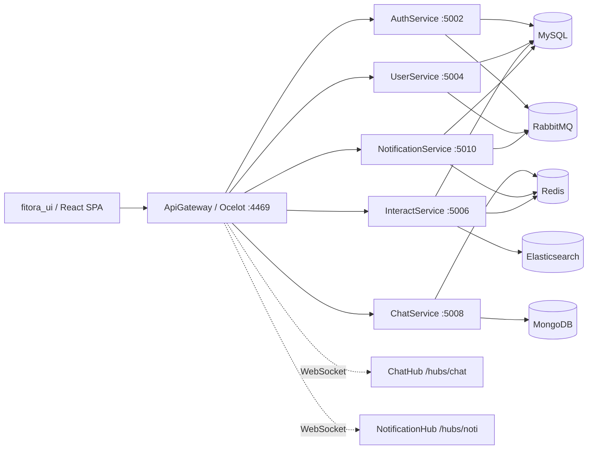

# Fitora Backend — Đồ án học phần Các hệ thống phân tán

Backend của Fitora là phần hệ thống phân tán viết bằng C#/.NET cho đề tài “Thiết kế và phát triển không gian học tập trên nền tảng Web và kiến trúc Microservice”. Mã nguồn trong repository này cung cấp API Gateway, các service nghiệp vụ, cấu hình giao tiếp đồng bộ/bất đồng bộ và script hỗ trợ chạy môi trường cục bộ.

## Thông tin học phần

| Nội dung | Thông tin |
|---|---|
| Học phần | Các hệ thống phân tán |
| Đề tài | Thiết kế và phát triển không gian học tập trên nền tảng Web và kiến trúc Microservice |
| Giảng viên hướng dẫn | TS. Kim Ngọc Bách |
| Mã lớp | M25CQHT02-B |
| Nhóm | 02 |
| Thành viên | Nguyễn Ngọc Anh - B25CHHT077; Nguyễn Thế Huy Hoàng - B25CHHT097; Mekdala Nounou - B25CHHT124 |
| Năm thực hiện | 2026 |

Tài liệu báo cáo nằm tại [report/BaiTapLon_Nhom_2_M25CQHT02-B.docx](report/BaiTapLon_Nhom_2_M25CQHT02-B.docx).

## Phạm vi repository

| Thành phần | Đường dẫn | Vai trò đã xác minh |
|---|---|---|
| API Gateway | `ApiGateways/ApiGateway` | Ocelot gateway, CORS, Swagger, WebSocket forwarding cho SignalR |
| Auth Service | `Services/AuthService` | Đăng ký, đăng nhập, refresh token, role/key/admin API, JWT/cookie auth |
| User Service | `Services/UserService` | Hồ sơ người dùng, nhóm, bạn bè, theo dõi; consumer tạo user sau đăng ký |
| Interact Service | `Services/InteractService` | Bài viết, bình luận, danh mục, báo cáo, upload, feed, vote/save |
| Chat Service | `Services/ChatService` | Hội thoại/tin nhắn qua MongoDB và SignalR hub `/hubs/chat` |
| Notification Service | `Services/NotificationService` | Lưu thông báo, SignalR hub `/hubs/noti`, consumer/publisher RabbitMQ |
| BuildingBlocks | `BuildingBlocks/BuildingBlocks` | Response, pagination, validation/logging behavior, auth helper, Redis rate-limit attribute |
| Script vận hành | `scripts/`, `Makefile` | Khởi động dependency/service, tạo dev certificate, in URL/log |

## Kiến trúc triển khai trong mã nguồn



Các cơ chế đã xác minh từ mã nguồn:

| Cơ chế | Bằng chứng trong repo | Ghi chú |
|---|---|---|
| API Gateway | `ApiGateways/ApiGateway/ocelot.json`, `Program.cs` | Route `/auth`, `/user`, `/interact`, `/chat`, `/notification`, `/chat`, `/noti` |
| Xác thực | `HybridAuthMiddleware`, `JwtBearer`, `AuthorizeExtension` | JWT/cookie; nhiều controller/hub dùng `[Authorize]` |
| Database quan hệ | EF Core migrations trong từng service | MySQL qua Pomelo/MySql EF Core; connection string để trống trong `appsettings.json` |
| MongoDB | `ChatService.Infrastructure` | Lưu conversation/message |
| Redis | `AddStackExchangeRedisCache`, SignalR Redis backplane, `RedisRateLimitAttribute` | Dùng cho cache/backplane; không ghi nhận centralized logging |
| RabbitMQ | `RabbitMQPublisher.cs`, `RabbitMQConsumer.cs`, hosted services | Queue đã thấy: `user_registration_queue`, `noti_queue`, `noti_realtime_queue` |
| Elasticsearch | `ElasticsearchPostService.cs`, `PostRepository.cs` | Index/search nội dung bài viết trong index `post-index` |
| Realtime | `ChatHub`, `NotificationHub`, frontend SignalR | Chat và thông báo qua SignalR |
| CI/CD | `.github/workflows/deploy-staging.yml` | Build/publish service lên Windows/IIS/self-hosted runner |

## Điểm cần phân biệt với báo cáo

| Nội dung | Trạng thái theo mã nguồn |
|---|---|
| Search Service độc lập | Chưa triển khai thành service riêng; tìm kiếm bài viết được tích hợp trong Interact Service qua Elasticsearch |
| Docker Compose toàn hệ thống | Chưa triển khai; `Services/docker-compose.yml` chỉ định nghĩa MongoDB, còn Redis/RabbitMQ/Elasticsearch được script PowerShell dựng thêm |
| Circuit breaker, distributed tracing, dead-letter queue, service discovery, Kubernetes, Saga, CQRS/Event Sourcing | Chưa xác minh từ mã nguồn; chỉ nên xem là hạn chế hoặc hướng phát triển nếu nêu trong báo cáo |
| Test tự động | Chưa thấy project test xUnit/NUnit/MSTest trong repository |
| Secret trong cấu hình mẫu | Có giá trị local/default trong `appsettings*.json` và compose; khi triển khai cần thay bằng secret/env riêng, không dùng lại trực tiếp |

## Yêu cầu môi trường

| Công cụ | Mục đích |
|---|---|
| .NET SDK 8.x | Restore/build/run solution |
| Docker Desktop | Chạy MongoDB, Redis, RabbitMQ, tùy chọn Elasticsearch |
| MySQL 8.x | Database quan hệ cho Auth/User/Interact/Notification |
| PowerShell | Chạy script trong `scripts/` và `Makefile` |
| GNU Make | Tùy chọn, dùng các target trong `Makefile` |

## Cấu hình cục bộ

1. Tạo database MySQL tương ứng cho các service.
2. Cập nhật connection string `ConnectionStrings:Database` trong các file `appsettings.Development.json` hoặc qua user-secrets/environment variables.
3. Không commit mật khẩu, token, private key hoặc connection string thật.
4. Nếu chạy HTTPS local, tạo certificate cho các service:

```powershell
.\scripts\renew-dev-certs.ps1
```

## Chạy dependency

Script an toàn sẽ chạy MongoDB, Redis, RabbitMQ và chỉ chạy Elasticsearch nếu image đã có sẵn trên máy.

```powershell
.\scripts\start-deps-safe.ps1
```

Nếu muốn ép chạy Elasticsearch và image đã pull được:

```powershell
.\scripts\start-deps.ps1
```

Các queue RabbitMQ được script tạo: `user_registration_queue`, `noti_queue`, `noti_realtime_queue`.

## Restore, build và chạy

```powershell
dotnet restore
dotnet build .\fitora_backend.sln
```

Chạy toàn bộ service bằng script:

```powershell
.\scripts\start-full-services-safe.ps1
```

Hoặc chạy từng service:

```powershell
dotnet run --project .\Services\AuthService\AuthService.API\AuthService.API.csproj --launch-profile https
dotnet run --project .\Services\UserService\UserService.API\UserService.API.csproj --launch-profile https
dotnet run --project .\Services\InteractService\InteractService.API\InteractService.API.csproj --launch-profile https
dotnet run --project .\Services\ChatService\ChatService.API\ChatService.API.csproj --launch-profile https
dotnet run --project .\Services\NotificationService\NotificationService.API\NotificationService.API.csproj --launch-profile https
dotnet run --project .\ApiGateways\ApiGateway\ApiGateway.csproj --launch-profile http
```

URL mặc định:

| Thành phần | URL |
|---|---|
| Gateway Swagger | `http://localhost:4469/swagger/index.html` |
| Auth Swagger | `https://localhost:5002/swagger/index.html` |
| User Swagger | `https://localhost:5004/swagger/index.html` |
| Interact Swagger | `https://localhost:5006/swagger/index.html` |
| Chat Swagger | `https://localhost:5008/swagger/index.html` |
| Notification Swagger | `https://localhost:5010/swagger/index.html` |
| RabbitMQ UI | `http://localhost:15672` |

## Migration database

Các migration EF Core nằm trong từng service infrastructure. Ví dụ:

```powershell
dotnet ef database update --project .\Services\AuthService\AuthService.Infrastructure\AuthService.Infrastructure.csproj --startup-project .\Services\AuthService\AuthService.API\AuthService.API.csproj
dotnet ef database update --project .\Services\UserService\UserService.Infrastructure\UserService.Infrastructure.csproj --startup-project .\Services\UserService\UserService.API\UserService.API.csproj
dotnet ef database update --project .\Services\InteractService\InteractService.Infrastructure\InteractService.Infrastructure.csproj --startup-project .\Services\InteractService\InteractService.API\InteractService.API.csproj
dotnet ef database update --project .\Services\NotificationService\NotificationService.Infrastructure\NotificationService.Infrastructure.csproj --startup-project .\Services\NotificationService\NotificationService.API\NotificationService.API.csproj
```

## API và realtime entrypoint

| Gateway path | Service đích |
|---|---|
| `/auth/{...}` | Auth Service `/api/auth/{...}` |
| `/user/{...}` | User Service `/api/user/{...}` |
| `/interact/{...}` | Interact Service `/api/interact/{...}` |
| `/chat/{...}` | Chat Service `/api/chat/{...}` |
| `/notification/{...}` | Notification Service `/api/notification/{...}` |
| `/chat`, `/chat/negotiate` | SignalR ChatHub |
| `/noti`, `/noti/negotiate` | SignalR NotificationHub |

Ví dụ endpoint đã thấy trong controller:

| Nhóm | Endpoint |
|---|---|
| Auth | `POST /auth/auth/register`, `POST /auth/auth/login`, `POST /auth/auth/refresh-token`, `POST /auth/auth/logout` |
| Interact/Post | `POST /interact/post/create`, `GET /interact/post/newfeed`, `GET /interact/post/trending-feed`, `GET /interact/post/explore-feed`, `PUT /interact/post/vote` |

## Kiểm thử và kiểm tra chất lượng

Repository hiện chưa có project test tự động. Các lệnh kiểm tra có thể xác minh trong phạm vi mã nguồn hiện tại:

```powershell
dotnet restore
dotnet build .\fitora_backend.sln
```

Kết quả rà soát ngày 2026-07-15: `dotnet restore` chạy trong bước build, nhưng `dotnet build .\fitora_backend.sln` chưa pass. Lỗi dừng ở `BuildingBlocks/BuildingBlocks/RepositoryBase/EntityFramework/RepositoryBase.cs`, gồm thiếu kiểu `PaginationRequest`, `PaginatedResult<>`, `ApplicationDbContext` và việc `RepositoryBase<TEntity>` chưa triển khai đủ interface `IRepositoryBase<TEntity>`. Vì vậy README không ghi nhận trạng thái build thành công.

Nếu bổ sung test project sau này, thêm hướng dẫn `dotnet test` kèm tên project cụ thể.

## Triển khai

Workflow `.github/workflows/deploy-staging.yml` chạy khi push nhánh `staging`. Pipeline build/publish các service .NET, triển khai một số service dạng Windows Service/Kestrel và một số service qua IIS trên self-hosted Windows runner.

Các tham số hạ tầng, certificate, connection string và secret triển khai phải đặt trong môi trường CI/CD hoặc cấu hình máy chủ, không ghi trực tiếp vào README.

## Liên kết repository

| Repository | Vai trò |
|---|---|
| `fitora_backend` | Backend C#/.NET, API Gateway và microservices |
| `fitora_ui` | Frontend TypeScript/React; trong workspace hiện checkout dưới thư mục `fitora-web`, remote Git là `fitora_ui` |
